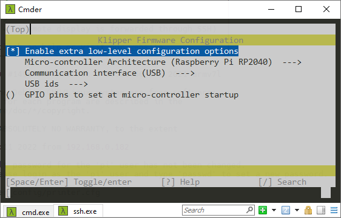
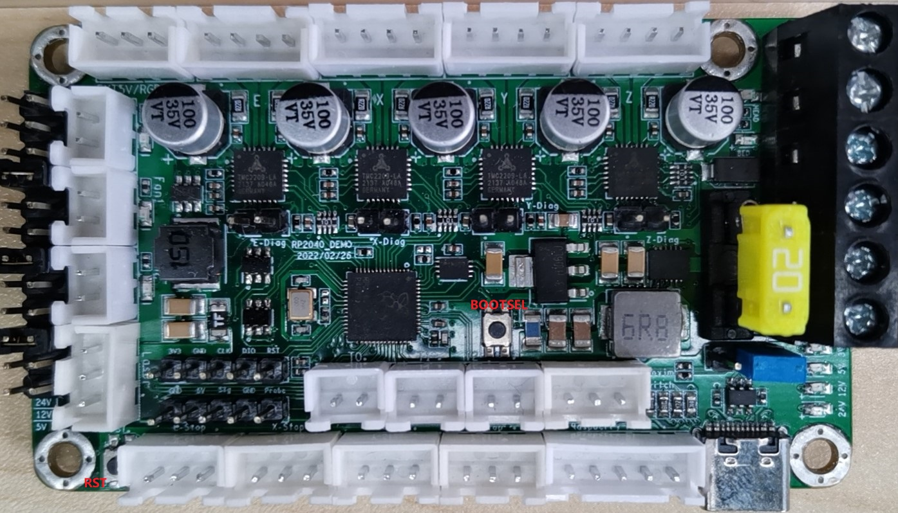
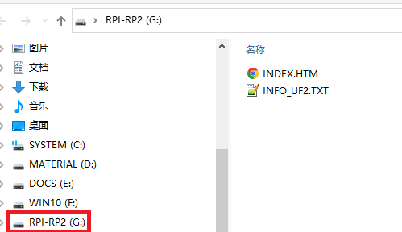

# FYSETC_R4

## Hardware

All related hardware files are in `hardware` folder in this repository.

## Firmware

FYSETC R4 only support Klipper firmware. All related Klipper firmware files like `printer.cfg` are in `firmware` folder in this repository.

### Klipper Compile options

### Firmware upload

Step 1: Power on the board

Step 2: Connect R4 to your computer with USBC cable

Step 3: Push an hold `BOOTSEL` button

Step 4: Click `RST` button and release `BOOTSEL` button

Step 5: `RPI-RP2` folder will show up on your computer, copy your built firmware `klipper.uf2` to the folder.

### Configuration

See `printer.cfg` in this repository `firmware` folder.

